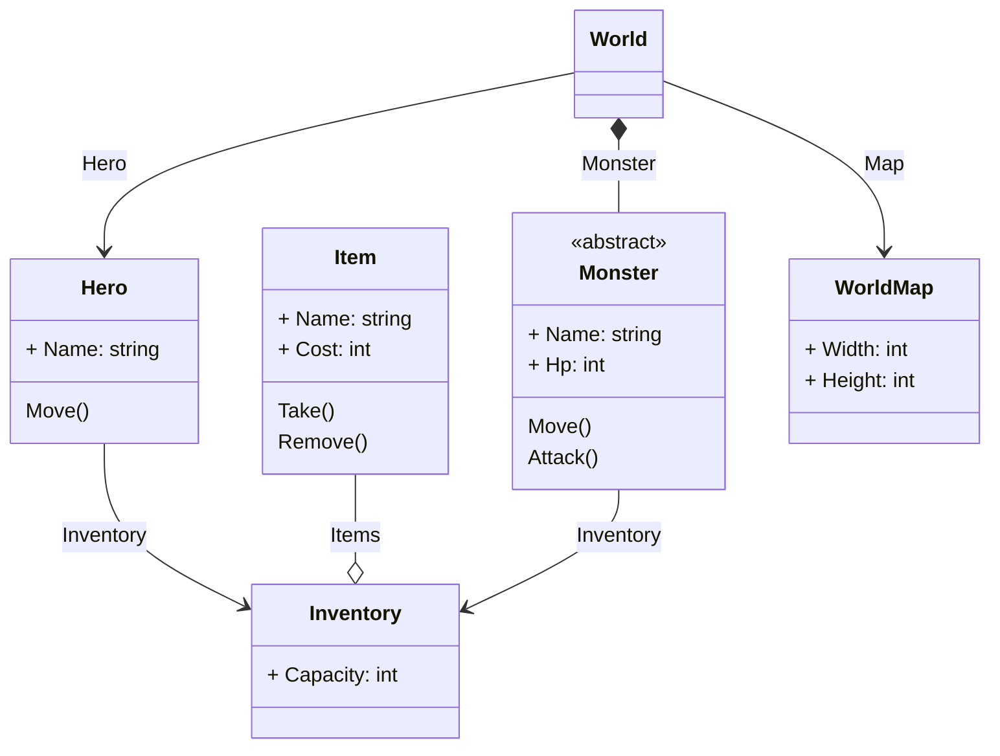

```mermaid
classDiagram

    class Hero {
        + Name: string
        Move()
    }

    class Monster {
        <<abstract>>
        + Name: string
        + Hp: int
        Move()
        Attack()
    }

    class Inventory {
        + Capacity: int

    }

    class Item {
        + Name: string
        + Cost: int
        Take()
        Remove()
    }

    class WorldMap {
        + Width: int
        + Height: int
    }


    Hero --> Inventory : Inventory
    Item --o Inventory : Items

    Monster --> Inventory : Inventory

    World --> Hero : Hero
    World *-- Monster : Monster
    World --> WorldMap : Map
```